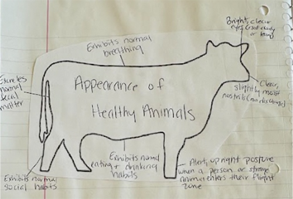

# Cow Health

   

## Some signs to look for :

* Not having trouble breathing
* Bright clear eyes 
* Slightly moist nostrils
* Alert with upright posture

## Vital Signs

| Temp (fahrenheit) | Respiration rate (per minitue) | Heart rate (per minute) |
| :---:             | :---:                          |                :---:    |
| 100.5 | 30 | 50 |