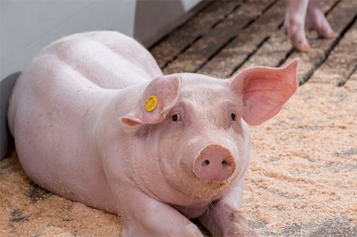

# Swine

### Pigs (also know as Swine) :

* Raised mainly for consumption of pork

* Very good at converting feed to meat (requires less per pound of feed to produce more meat)

* Produces large numbers of young at one time

* Monogastie (only having one main stomach)

### Vital Signs

| Temp (fahrenheit) | Respiration rate (per minitue) | Heart rate (per minute) |
| :---:             | :---:                          |                :---:    |
| 102.5 | 16 | 60 |
