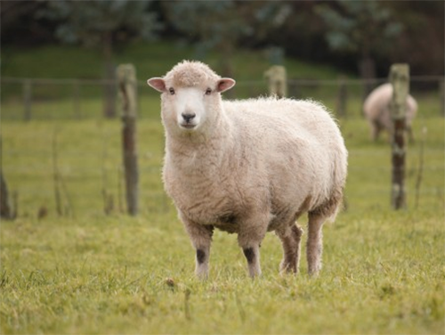

# Sheep and Goats

|  |  | 
| :---:                                             | :---:                                          |    

* raised for food & clothing

* sheep are economically advantageous over goats

* managment of sheep & goats are very similar

* both are ruminants

### Vital Signs (sheep)

| Temp (fahrenheit) | Respiration rate (per minitue) | Heart rate (per minute) |
| :---:             | :---:                          |                :---:    |
| 102.3 | 19 | 75 |

### Vital Signs (goat)

| Temp (fahrenheit) | Respiration rate (per minitue) | Heart rate (per minute) |
| :---:             | :---:                          |                :---:    |
| 100 | 12 | 45 |
