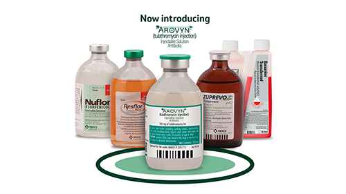
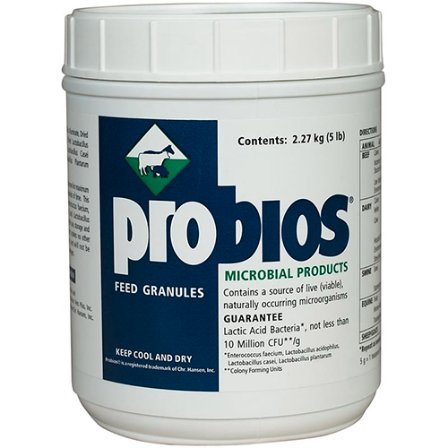
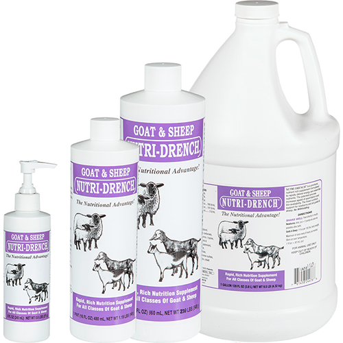
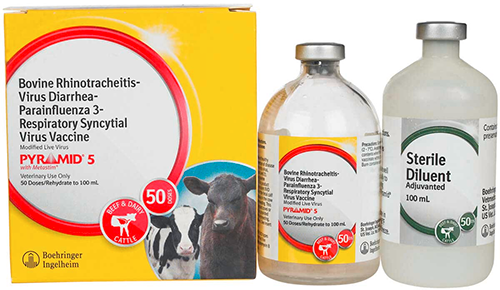
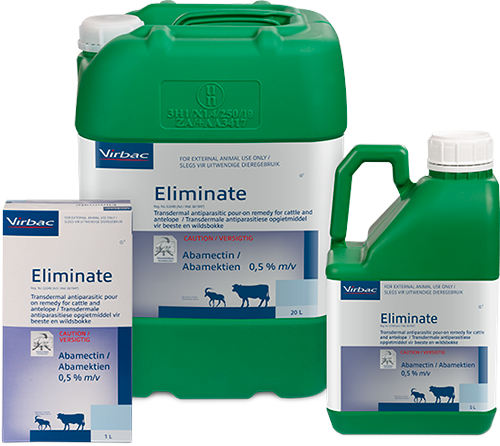

# Commonly used medications for livestock

### Antibiotics :

* Pharmaceutical formulation (attacks disease-causing microorganisms)

* Penicillin: common treatment for infections

* Draxxin

* Nuflor

### Probiotics :

* Promotes the health of beneficial microorganisms in the animal's gut

* Probios: stimulates gut health

### Nutritional Supplements :

* Prevents / treats health problems caused by deficiency of vitamins and minerals in diet

* Bo-Se: white muscle disease

* Multimin 90: zinc, manganese, selenium, and copper

### Vaccines :

* Biological formulation of a Killed / modified live onganism that causes disease, used to prevent diseases

* Banamine: fever, colic in horse

* Bar-Vac CD/T: protects from tetanus

### Parasiticides

* Used to control internal /external parasites

* Ivermectin

* Dectomax

* Prohibit